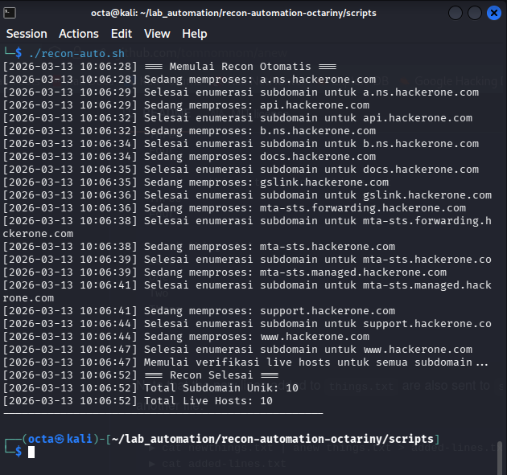
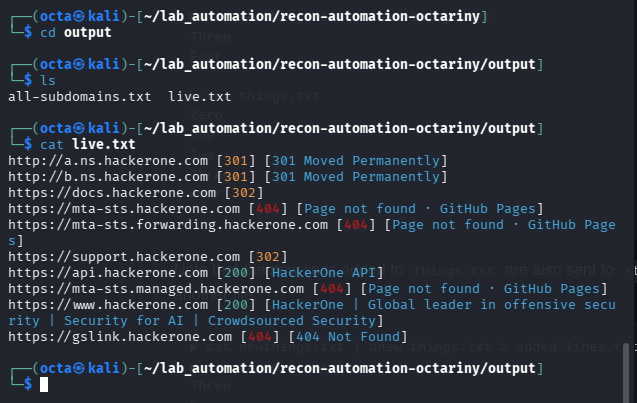

# recon-automation-octariny
Recon Automation Tool - octariny

## Deskripsi Proyek
Proyek ini adalah script otomatisasi proses Reconnaissance (pengintaian) subdomain yang dirancang untuk efisiensi dan akurasi. Script ini melakukan enumerasi subdomain dari daftar domain target, melakukan deduplikasi secara real-time, dan memverifikasi host yang aktif (live).

## Setup Environment
Untuk menjalankan script ini, pastikan Anda telah menginstal Go dan alat-alat berikut menggunakan pdtm (ProjectDiscovery Tool Manager) atau secara manual:
1. Install pdtm (jika belum ada): \
    (```go install github.com/projectdiscovery/pdtm/cmd/pdtm@latest```) 
2. Install Tools Pendukung: \
    anew: \
    (```go install github.com/tomnomnom/anew@latest (Wajib untuk deduplikasi)```) \
    assetfinder: \
    (```go install github.com/tomnomnom/assetfinder@latest```)\
    httpx: \
    (```pdtm -install httpx```)

## Cara Menjalankan Script
Pastikan struktur folder sudah sesuai (terdapat folder input, output, scripts, dan logs).
1. Masukkan daftar domain target ke dalam file input/domains.txt.
2. Berikan izin eksekusi pada script: \
    (```(chmod +x scripts/recon-auto.sh)```) 
3. Jalankan script dari root direktori: \
    (```(./scripts/recon-auto.sh)```) 

## Input & Output
### Input (input/domains.txt):
[a.ns.hackerone.com](a.ns.hackerone.com)\
[api.hackerone.com](api.hackerone.com)\
[b.ns.hackerone.com](b.ns.hackerone.com)\
[docs.hackerone.com](docs.hackerone.com)\
[gslink.hackerone.com](gslink.hackerone.com)\
[mta-sts.forwarding.hackerone.com](mta-sts.forwarding.hackerone.com)\
[mta-sts.hackerone.com](mta-sts.hackerone.com)\
[mta-sts.managed.hackerone.com](mta-sts.managed.hackerone.com)\
[support.hackerone.com](support.hackerone.com)\
[www.hackerone.com](www.hackerone.com)

### Output:
Directory:
recon-automation-octariny/ \
├── input/ \
│   └── domains.txt          # Minimal 5 domain \
├── output/ \
│   ├── all-subdomains.txt\
│   └── live.txt             # Hasil akhir: live hosts\
├── scripts/ \
│   └── recon-auto.sh        # Script utama (executable) \
├── logs/ \
│   ├── progress.log \
│   └── errors.log \
└── README.md                # Dokumentasi lengkap 


* output/all-subdomains.txt: Daftar seluruh subdomain unik yang ditemukan. 
* output/live.txt: Daftar subdomain yang merespon (status aktif). 

## Penjelasan Kode
- (```anew```): Digunakan untuk menyaring hasil enumerasi agar hanya data unik yang masuk ke file output tanpa perlu mengurutkan (sorting) ulang secara manual.
- (```2>> "$ERROR_LOG"```): Mengalihkan Standard Error (stderr) ke file log terpisah agar terminal tetap bersih dan memudahkan proses debugging.
- (```tee -a "$PROGRESS_LOG"```): Mencatat aktivitas proses ke layar terminal sekaligus menyimpannya ke file log secara append.
- (```while read -r domain```) : Loop yang memungkinkan script memproses banyak domain secara berurutan dalam satu kali jalan.

## Screenshots

1. Eksekusi Terminal \


2. Hasil Output live.txt \

